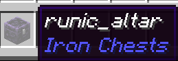
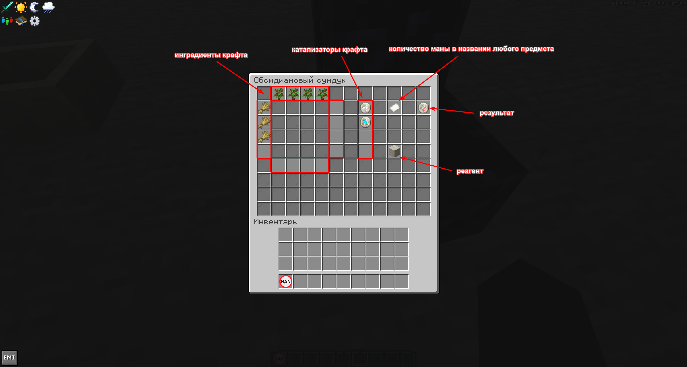
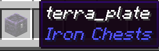
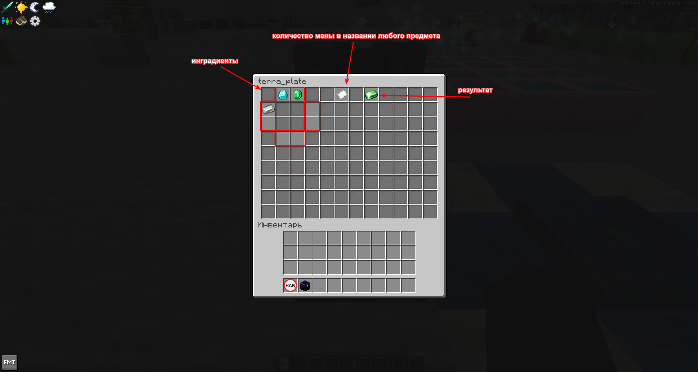
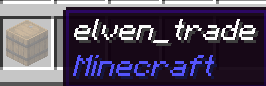
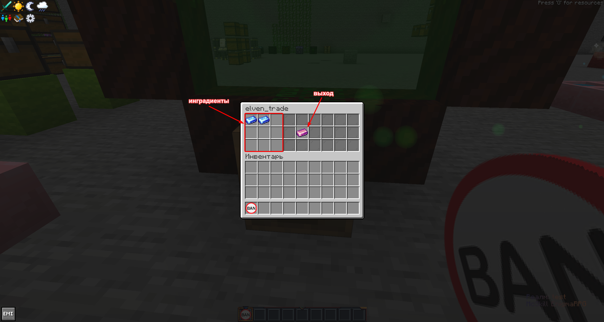

# Botania

Все скрипты доступны на EnigmaRPG

---

## Бассейн

### Настройка бочки
!!!
Юзается ванильная бочка `minecraft:barrel`, **названная на наковальне как `mana_infusion`**

!!!
### Слоты в бочке 
---
### Использование
!!!
Тыкаем предметом "Админский предмет" `kubejs:admin_item`
 
!!!
> На выходе получаем json крафта, который используем в `event.custom`

---
## Рунический алтарь

### Настройка сундука
!!!
Юзается обсидиановый сундук `ironchest:obsidian_chest`, **названный на наковальне как `runic_altar`**

!!!
### Слоты в сундуке 
---
### Использование
!!!
Тыкаем предметом "Админский предмет" `kubejs:admin_item`
 
!!!
> На выходе получаем json крафта, который используем в `event.custom`

---
## Агломерационная плита

### Настройка сундука
!!!
Юзается обсидиановый сундук `ironchest:obsidian_chest`, **названный на наковальне как `terra_plate`**

!!!
### Слоты в сундуке 
---
### Использование
!!!
Тыкаем предметом "Админский предмет" `kubejs:admin_item`
 
!!!
> На выходе получаем json крафта, который используем в `event.custom`

---

## Портал в эльфхейм

### Настройка бочки
!!!
Юзается ванильная бочка `minecraft:barrel`, **названная на наковальне как `elven_trade`**

!!!
### Слоты в бочке 
---
### Использование
!!!
Тыкаем предметом "Админский предмет" `kubejs:admin_item`
 
!!!
> На выходе получаем json крафта, который используем в `event.custom`